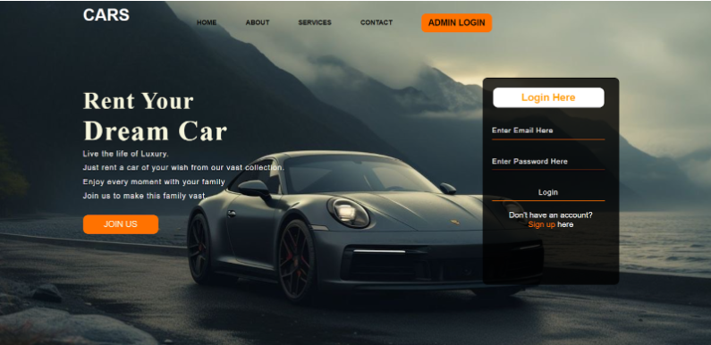
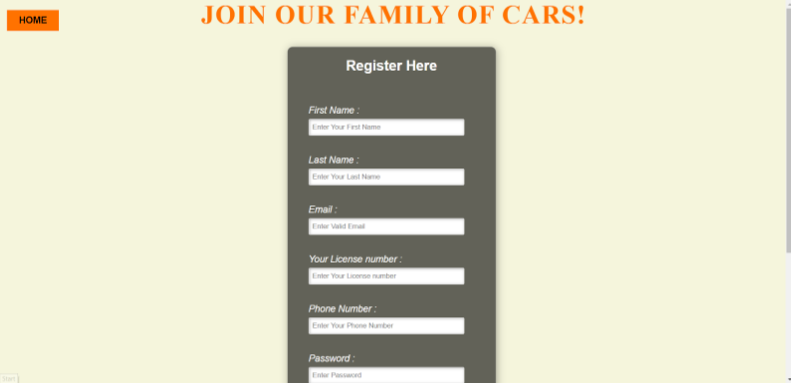
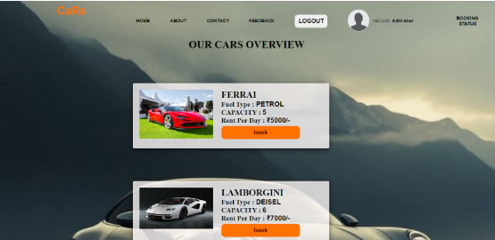
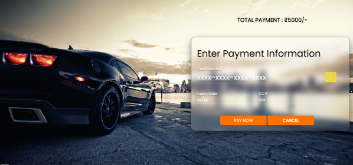
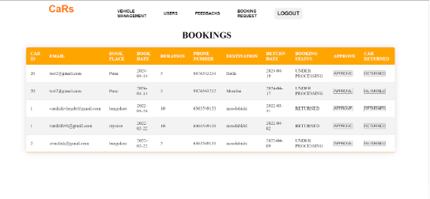
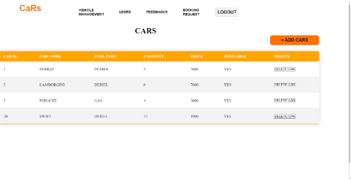
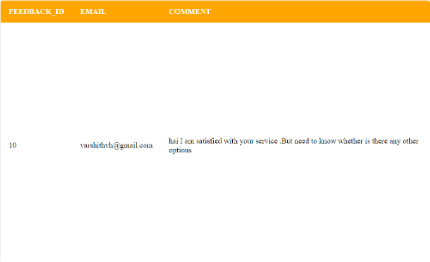

# Online Car Rental System

## Table of Contents
1. [Introduction](#chapter-1-introduction)
2. [Requirement Analysis](#chapter-2-requirement-analysis)
3. [Project Design](#chapter-3-project-design)
4. [Results](#chapter-4-results)
5. [Conclusion](#chapter-5-conclusion)

---

## Chapter 1: Introduction

### Problem Statement
Car rental project using PHP is a web-based application designed for large, premium, and small car rental businesses. The system provides complete functionality for listing and booking cars.

### Project Idea/Objectives
The project aims to develop an Online Car Rental System using PHP and MySQL to:
- Create a user-friendly platform for clients to book cars.
- Provide comprehensive management features for administrators.
- Offer additional services like hiring professional drivers.

### Motivation
Enhance the convenience and accessibility of car rental services for clients by streamlining the booking process and offering additional services.

### Scope
- Develop frontend interfaces for client interaction.
- Design user-friendly UI for browsing cars and making bookings.
- Create backend systems for managing bookings and administrative tasks.
- Implement administrative interfaces for managing system functionalities.
- Ensure scalability, customization, security, and integration of third-party services.

---

## Chapter 2: Requirement Analysis

### Text Editor
Utilize Visual Studio Code (VS Code) as the primary text editor.

### HTML Structure
Define the basic structure of the website using HTML.

### CSS Styling
Implement CSS styles for visual appearance and responsiveness.

### Responsive Design
Use media queries and flexible layout techniques for responsive design.

### JavaScript Functionality
Incorporate JavaScript for interactive features.

### PHP Functionality
Develop structured formats for storing information.

### Database
Use MySQL to store information in a structured format.

---

## Chapter 3: Project Design

### Hardware Requirements
- Computer with sufficient processing power, memory, and storage.
- Monitor with a resolution of at least 1280x800 pixels.
- Keyboard and mouse.
- Stable internet connection.

### Software Requirements
- Operating System: Windows, macOS, or Linux.
- Text Editor: Visual Studio Code.
- Web Browser: Google Chrome, Mozilla Firefox, Safari, or Microsoft Edge.
- Local Server Environment: Apache, Nginx, or similar.
- Database Management System: MySQL.

### Resources
- Online documentation and tutorials.
- Sample code snippets, templates, and starter projects.

---

## Chapter 4: Results

### 4.1 Website Frontend
The frontend features a user-friendly interface with various pages as shown below.

### 4.2 Website Backend
The backend includes features for managing bookings, vehicles, and feedback.

<!-- Add more backend images -->

---

## Chapter 5: Conclusion

The development of the Online Car Rental System aims to improve the convenience and accessibility of car rental services. By leveraging modern technologies and user-centered design principles, the system aims to enhance the overall experience for clients and make car rental services more accessible and user-friendly.
